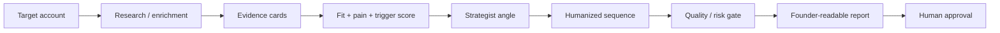
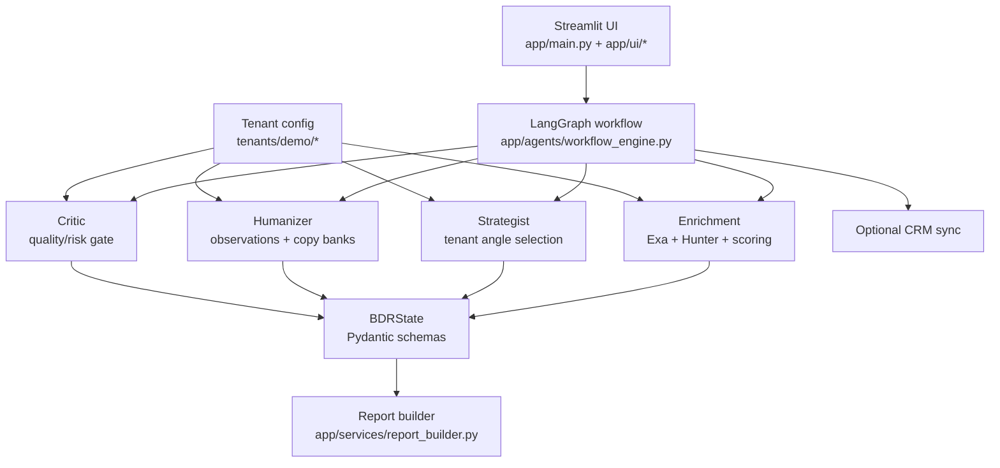
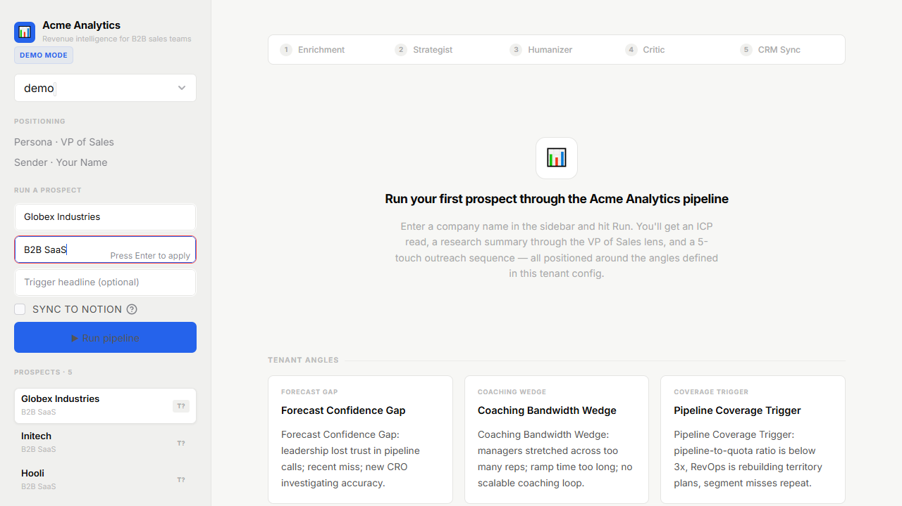
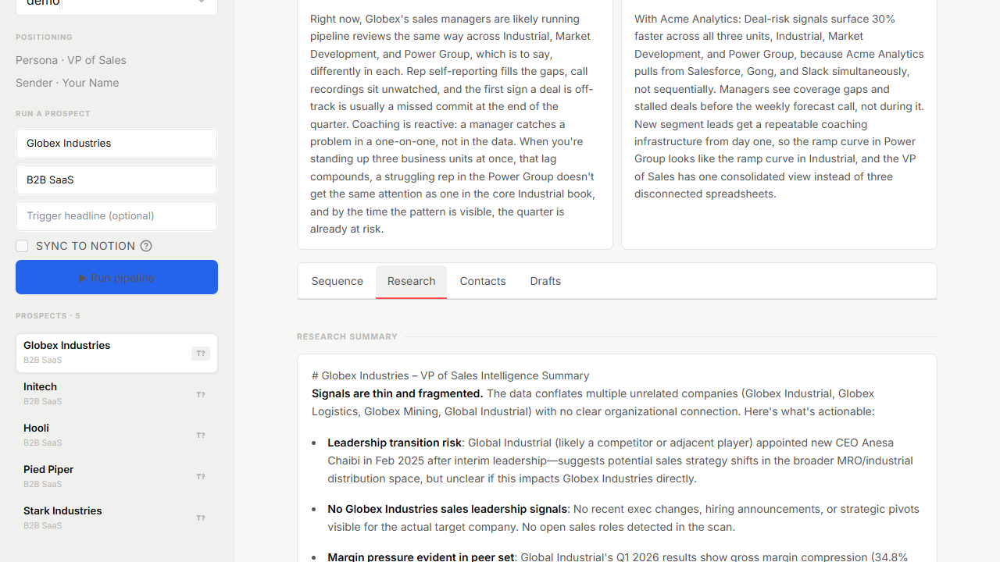
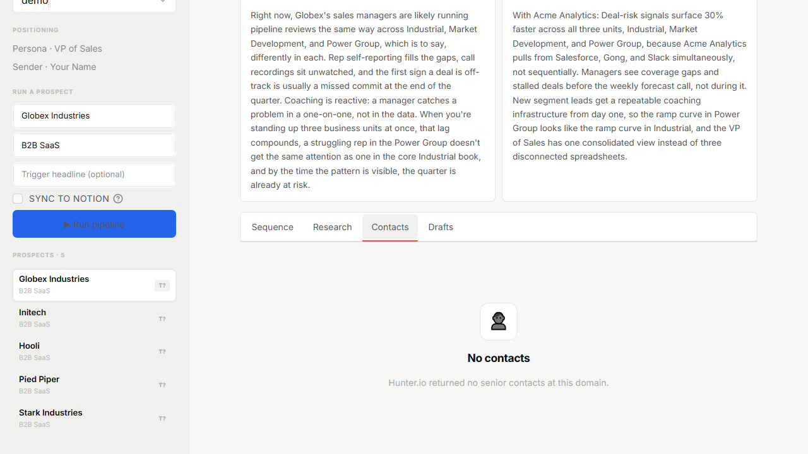
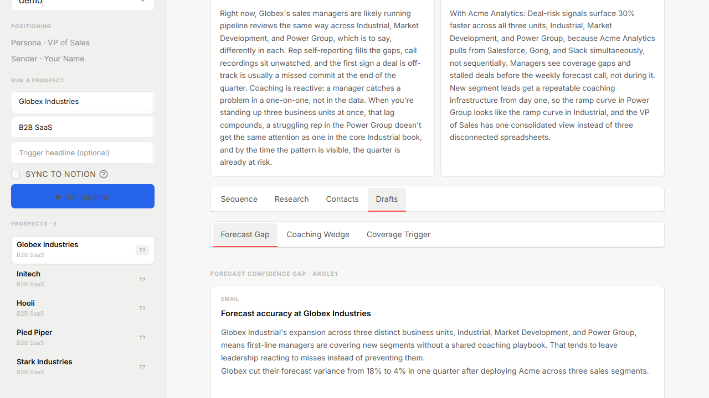
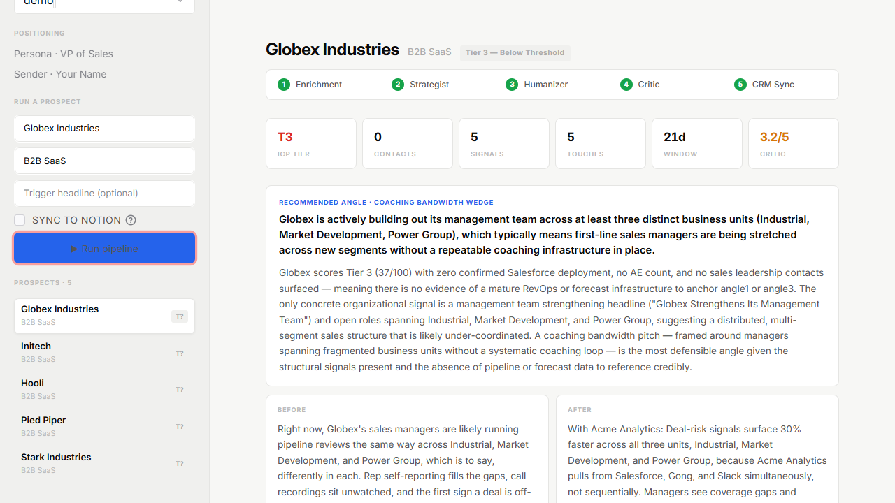
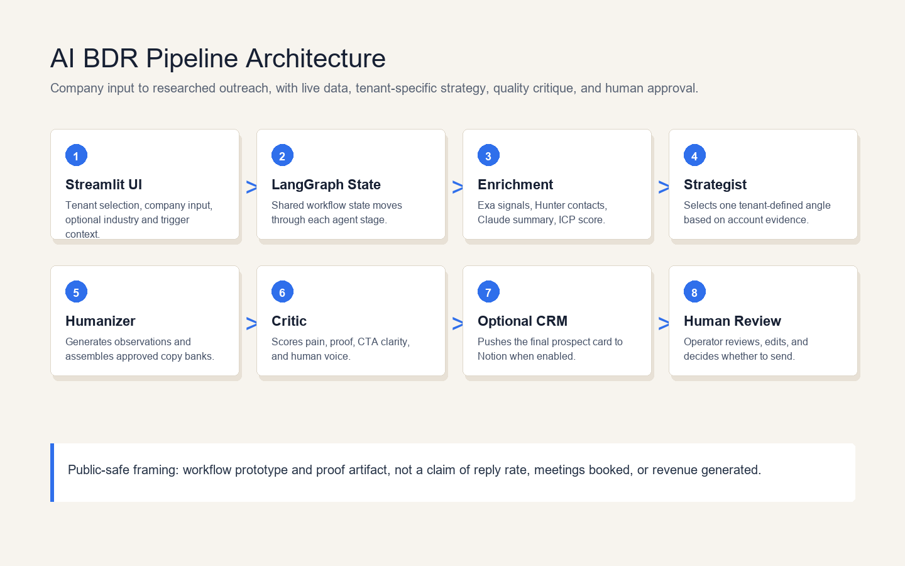

# BDR Pipeline

Founder-safe AI BDR workflow for sourced, scored, human-approved outreach.

> I built a multi-agent BDR workflow that researches accounts, finds contacts, scores fit and timing, generates outreach, critiques quality and risk, and keeps a human in the approval loop.

This is a portfolio-grade workflow prototype, not an autonomous sending tool and not a revenue case study. Demo companies are anonymized/synthetic examples unless explicitly documented otherwise.

## Problem

Founder-led outbound often breaks in the messy middle: research is thin, personalization is hard to verify, drafts drift into generic AI copy, and founders still need to approve anything that represents the company.

This project packages that workflow into a Streamlit + LangGraph app that separates evidence from inference, scores account readiness, drafts a cautious sequence, and makes the approval decision explicit.

## What The App Does

The app takes a target account and produces a founder-readable outbound package:

- research/enrichment with evidence cards
- contact discovery when data is available
- fit, pain, and trigger account-readiness scoring
- a strategist-selected outreach angle
- a humanized multi-touch outreach sequence
- a quality/risk gate that can say `approved`, `needs_edit`, `needs_more_research`, or `do_not_send_yet`
- a report tab with a downloadable Markdown account report

No auto-send is built into the app flow.

## Demo Workflow

1. Select the `demo` tenant.
2. Pick a demo prospect from the sidebar or choose `Custom account`.
3. Run the pipeline.
4. Review the Report tab first.
5. Inspect evidence cards, score components, contacts, sequence, and quality gate.
6. Download the Markdown report for human review.

Detailed walkthrough: [docs/demo-guide.md](docs/demo-guide.md)

Demo prospects live at [tenants/demo/data/prospects.csv](tenants/demo/data/prospects.csv). They are anonymized/synthetic portfolio examples. No reply or meeting metrics are claimed.

## Workflow Diagram



## Architecture



## Core Features

- **Evidence-backed research cards**: each key claim is represented as observed, derived, or inferred evidence with confidence and source context.
- **Account-readiness scoring**: transparent fit, pain, trigger, contact-confidence, and evidence-quality components roll up into a 0-100 account score.
- **Quality/risk gate**: critic output flags unsupported claims, thin evidence, weak personalization, tone issues, and send-readiness problems.
- **Account report**: the Report tab packages score, evidence, contact recommendation, sequence, risk flags, and manual approval checklist into Markdown.
- **Demo presets**: the demo tenant can load preset accounts from [tenants/demo/data/prospects.csv](tenants/demo/data/prospects.csv), while custom input still works.
- **Result persistence**: completed Streamlit results stay visible across harmless reruns such as report download clicks.
- **Eval metrics**: [scripts/run_demo_eval.py](scripts/run_demo_eval.py) generates internal workflow-quality metrics, not campaign-performance claims.

## Screenshots

| Step | Screenshot |
|---|---|
| Input and tenant selection |  |
| Research signals |  |
| Contact discovery |  |
| Positioning angles |  |
| Outreach sequence |  |
| Critic quality pass |  |
| Final report/output |  |
| Architecture diagram |  |

HD screenshots are also available under [docs/screenshots-hd/](docs/screenshots-hd/).

## Demo Video

Available local demo videos:

- [docs/bdr-pipeline-demo-v4-polished.mp4](docs/bdr-pipeline-demo-v4-polished.mp4)
- [docs/bdr-pipeline-demo-v3-synced-compressed.mp4](docs/bdr-pipeline-demo-v3-synced-compressed.mp4)
- [docs/bdr-pipeline-demo-v2.mp4](docs/bdr-pipeline-demo-v2.mp4)

Use the latest polished video unless you need older versions for comparison.

## Setup

```bash
git clone https://github.com/suhrckemanuel-del/BDR-pipeline.git
cd BDR-pipeline

python -m venv .venv
source .venv/bin/activate
pip install -r requirements.txt

cp .env.example .env
```

On Windows PowerShell:

```powershell
python -m venv .venv
.\.venv\Scripts\Activate.ps1
pip install -r requirements.txt
Copy-Item .env.example .env
```

Fill `.env` with your own keys. Do not commit `.env`.

## Environment Variables

Required for the full live pipeline:

| Variable | Purpose |
|---|---|
| `ANTHROPIC_API_KEY` | LLM calls for enrichment synthesis, strategy, humanizer, and critic. |
| `EXA_API_KEY` | Live web/news/job signal enrichment. |
| `HUNTER_API_KEY` | Contact discovery by company domain. |

Optional:

| Variable | Purpose |
|---|---|
| `NOTION_API_KEY` | Optional CRM sync if enabled for a tenant. |
| `NOTION_DATABASE_ID` | Optional Notion database target. |
| `GMAIL_SENDER` | Optional send script sender account. |
| `GMAIL_APP_PASSWORD` | Optional Gmail app password for the send script. |
| `BDR_TENANT` | Pins the active tenant, e.g. `demo`. |
| `LANGCHAIN_API_KEY` | Optional tracing. |

See [.env.example](.env.example) for the canonical list. Never expose real key values in docs, screenshots, or demos.

## Run Streamlit

```bash
streamlit run app/main.py
```

Use a specific port:

```bash
streamlit run app/main.py --server.port 8503 --server.headless true
```

Pin the demo tenant:

```bash
BDR_TENANT=demo streamlit run app/main.py
```

On PowerShell:

```powershell
$env:BDR_TENANT="demo"
streamlit run app/main.py
```

## Run Eval Metrics

Default offline/sample-state mode:

```bash
python scripts/run_demo_eval.py
```

Optional live workflow mode:

```bash
python scripts/run_demo_eval.py --mode live --max-accounts 2
```

Outputs:

- [docs/evals.md](docs/evals.md)
- [docs/eval-results.csv](docs/eval-results.csv)
- [docs/eval-results.json](docs/eval-results.json)

These are internal workflow metrics: completion, runtime, evidence count, high-confidence evidence, contact count, score, gate verdict, risk flags, unsupported claim count, and report generation status. They do not measure replies, meetings, revenue, or campaign lift.

## Example Output

The Report tab generates a Markdown account report named like:

```text
bdr-account-report-globex-industries.md
```

Report sections include:

- metadata and manual-review notice
- decision summary
- score and priority
- evidence highlights
- recommended contact or "No verified contact found"
- outreach recommendation
- quality/risk gate
- human approval checklist
- limitations

The report is assembled deterministically from pipeline state by [app/services/report_builder.py](app/services/report_builder.py). It does not add a separate "make it pretty" LLM call.

## Honest Metrics

Latest generated eval summary: [docs/evals.md](docs/evals.md)

Current sample eval output reports internal workflow checks only. It answers questions like:

- Did the run complete?
- How many evidence cards were produced?
- How many high-confidence evidence cards exist?
- Was a report generated?
- What did the quality gate decide?
- How many risk flags or unsupported claims were recorded?

It does not prove:

- reply-rate lift
- meetings booked
- revenue impact
- deliverability
- production reliability on real customer data

## Limitations

- Public demo data is anonymized/synthetic.
- Contact discovery depends on third-party data availability and may return no contacts for demo accounts.
- Evidence confidence is a workflow signal, not independent fact verification.
- The system drafts outreach for human review; it does not approve or send autonomously.
- Live runs depend on API keys, network access, and model/provider availability.
- No campaign performance metrics are claimed.
- No private client permission is implied by this repository.

## Portfolio Positioning

This repo is best presented as a practical AI workflow proof artifact for founder-led B2B SaaS outbound.

Strong public claim:

> I built a multi-agent BDR workflow that researches accounts, finds contacts, scores fit and timing, generates outreach, critiques quality and risk, and keeps a human in the approval loop.

Avoid claiming that it generated revenue, improved reply rates, booked meetings, replaces SDRs, sends safely at scale, or is production-ready for unsupervised outbound.

## Documentation

- [docs/handoff.md](docs/handoff.md): start here if another AI or reviewer needs project context.
- [docs/demo-guide.md](docs/demo-guide.md): how to demo the app and what to say.
- [docs/roadmap.md](docs/roadmap.md): next polish, product, evaluation, integration, and long-term work.
- [docs/evals.md](docs/evals.md): latest generated internal eval summary.
- [docs/portfolio-proof-package.md](docs/portfolio-proof-package.md): older portfolio packaging notes.
- [tenants/README.md](tenants/README.md): tenant configuration guide.

## Key Files

```text
app/main.py                         Streamlit entrypoint
app/ui/layout.py                    Sidebar, result routing, tabs
app/ui/components.py                UI components
app/agents/workflow_engine.py       LangGraph orchestration
app/agents/state.py                 Shared workflow state and schemas
app/agents/enrichment.py            Research, evidence, contacts, scoring
app/agents/strategist.py            Angle selection
app/agents/humanizer.py             Sequence generation
app/agents/critic.py                Quality/risk gate
app/services/report_builder.py      Markdown account report
app/services/demo_eval.py           Eval metrics helpers
scripts/run_demo_eval.py            Eval CLI
tenants/demo/                       Demo tenant config and data
```

## Roadmap

See [docs/roadmap.md](docs/roadmap.md). Near-term recommended next build: saved reports/review queue with explicit manual approval state.

## License

MIT - see [LICENSE](LICENSE).
