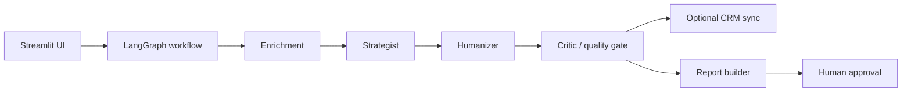

# BDR Pipeline Handoff

Read this first if you are another AI, founder, reviewer, or future maintainer picking up the project without chat history.

## Project Purpose

BDR Pipeline is a portfolio-grade AI workflow prototype for founder-led B2B SaaS outbound.

Positioning:

> Founder-safe AI BDR workflow for sourced, scored, human-approved outreach.

Strong public claim:

> I built a multi-agent BDR workflow that researches accounts, finds contacts, scores fit and timing, generates outreach, critiques quality and risk, and keeps a human in the approval loop.

Do not present this as an autonomous sending system, SDR replacement, revenue case study, or proven campaign-performance engine.

## Product Thesis

Early outbound is risky when the founder's voice and credibility are on the line. The useful product shape is not "AI sends more emails." It is a workflow that:

- gathers account evidence
- distinguishes observed evidence from inference
- scores whether the account is ready for outreach
- drafts a sequence from approved positioning and copy banks
- blocks or flags weak/unsafe outreach
- produces a readable report for human approval

The human review step is part of the product, not a temporary limitation.

## Current Architecture



Main stack:

- Streamlit UI
- LangGraph workflow orchestration
- Anthropic/Claude LLM calls
- Exa enrichment for live signals
- Hunter.io contact discovery
- Pydantic schemas for structured state
- Tenant config files for ICP, angles, and copy banks
- Optional Notion/Gmail support scripts

## Timeline Of Builds

| Build | Added |
|---|---|
| Build 01 | Evidence-backed research cards. |
| Build 02 | Fit, pain, and trigger account-readiness scoring. |
| Build 03 | Quality/risk gate with verdicts and risk flags. |
| Build 04 | Founder-readable Account Report tab and Markdown download. |
| Build 05 | Demo prospect presets and Streamlit result persistence. |
| Build 06 | Lightweight internal demo/eval metrics. |
| Build 07 | Handoff-ready README and documentation package. |

## Current App Flow

1. User selects a tenant, usually `demo`.
2. User selects a preset demo prospect or enters a custom account.
3. Streamlit runs the LangGraph pipeline.
4. Enrichment gathers signals, contacts, evidence cards, ICP tier, and account score.
5. Strategist chooses one tenant-defined angle.
6. Humanizer writes observations and assembles a multi-touch sequence from copy banks.
7. Critic scores copy quality and produces a quality/risk gate.
8. Optional CRM sync runs if configured.
9. UI renders Report, Sequence, Research, Contacts, and Drafts tabs.
10. User downloads a Markdown report and manually reviews before any sending.

## Key Files And Modules

| File | Purpose |
|---|---|
| [app/main.py](../app/main.py) | Streamlit entrypoint, tenant resolution, run routing, result persistence. |
| [app/ui/layout.py](../app/ui/layout.py) | Sidebar inputs, demo presets, empty/running/result layouts, report tab. |
| [app/ui/components.py](../app/ui/components.py) | Reusable Streamlit/HTML UI components. |
| [app/ui/theme.py](../app/ui/theme.py) | Chalk-style visual theme. |
| [app/agents/workflow_engine.py](../app/agents/workflow_engine.py) | LangGraph DAG and run helpers. |
| [app/agents/state.py](../app/agents/state.py) | BDRState and Pydantic output schemas. |
| [app/agents/enrichment.py](../app/agents/enrichment.py) | Exa/Hunter enrichment, evidence cards, ICP and account scoring. |
| [app/agents/strategist.py](../app/agents/strategist.py) | Tenant angle selection. |
| [app/agents/humanizer.py](../app/agents/humanizer.py) | Observation generation and deterministic sequence assembly. |
| [app/agents/critic.py](../app/agents/critic.py) | Quality scoring, risk gate, cautious rewrites. |
| [app/services/report_builder.py](../app/services/report_builder.py) | Deterministic Markdown account report. |
| [app/services/demo_eval.py](../app/services/demo_eval.py) | Internal metrics extraction and eval docs generation. |
| [scripts/run_demo_eval.py](../scripts/run_demo_eval.py) | CLI for sample/live eval metrics. |
| [tenants/demo/](../tenants/demo) | Demo tenant config, ICP, angles, copy, and prospects. |
| [docs/evals.md](evals.md) | Latest internal eval summary. |

## How To Run Locally

```bash
python -m venv .venv
source .venv/bin/activate
pip install -r requirements.txt
cp .env.example .env
streamlit run app/main.py
```

PowerShell:

```powershell
python -m venv .venv
.\.venv\Scripts\Activate.ps1
pip install -r requirements.txt
Copy-Item .env.example .env
streamlit run app/main.py
```

Use port `8503` for repeatable local demos:

```bash
streamlit run app/main.py --server.port 8503 --server.headless true
```

Required live-pipeline keys are `ANTHROPIC_API_KEY`, `EXA_API_KEY`, and `HUNTER_API_KEY`. Missing enrichment keys should be treated as degraded demo conditions, not hidden success.

## How To Test

Minimum check:

```bash
python -m compileall app scripts
```

Tenant validation:

```bash
python scripts/check_tenant.py
```

Eval metrics:

```bash
python scripts/run_demo_eval.py
```

Optional live eval:

```bash
python scripts/run_demo_eval.py --mode live --max-accounts 2
```

Manual Streamlit check:

1. Start Streamlit.
2. Select `demo`.
3. Select a demo prospect.
4. Confirm sidebar fields fill.
5. Run pipeline.
6. Confirm tabs: Report, Sequence, Research, Contacts, Drafts.
7. Click Markdown download.
8. Confirm the app still shows the completed result.
9. Click Clear last result and confirm empty state returns.

## Known Issues

- Demo companies are synthetic/anonymized, so live enrichment and contact discovery may be thin.
- Hunter.io can return no contacts for demo domains.
- Streamlit reruns are normal; result persistence handles harmless reruns for the active tenant only.
- `.env.example` may contain older encoding artifacts in comments; do not copy any secret values into docs.
- The optional Notion/Gmail pieces are not the core demo path.
- Live eval mode depends on API keys, network access, and vendor availability.

## Current Limitations

- No saved review queue or durable report library.
- No explicit approval state beyond human review instructions.
- No reply analytics or outcome tracking.
- No deliverability checks.
- No production-grade authentication, tenancy, or permissions model.
- No proof of campaign performance.
- No autonomous sending in the Streamlit workflow.

## What Not To Overclaim

Do not claim:

- generated revenue
- improved reply rates
- booked meetings
- campaign lift
- autonomous sending
- replacing SDRs
- safe sending at scale
- production reliability on real customer data
- client permission unless explicitly documented elsewhere

Safe claim:

> This is a workflow prototype and portfolio proof artifact that demonstrates account research, evidence handling, scoring, sequence generation, quality critique, reporting, and human approval.

## Next Recommended Builds

1. Saved reports / review queue with durable local storage.
2. Manual approval state (`draft`, `approved`, `needs_research`, `blocked`).
3. Founder voice layer that stores reviewed examples and constraints.
4. Deliverability and compliance checks before any send path.
5. Touch-level outcome tracking for future real campaign data.
6. New demo video refresh that shows Build 05-07 features.

## Deferred Features

- Auto-send
- Reply analytics dashboard
- LLM council as a primary generation path
- CRM rewrite
- New outbound channels
- Revenue attribution
- Autonomous campaign optimization

## Safety And Privacy Notes

- Do not commit `.env`.
- Do not expose API keys in screenshots, docs, logs, or generated reports.
- Keep demo prospects framed as anonymized/synthetic.
- Do not publish real client names, logos, contacts, CRM screenshots, or campaign outcomes without explicit permission.
- Treat personal emails and contact data as sensitive.
- Human review is required before sending any outreach.
