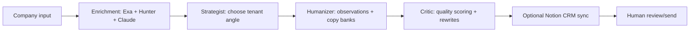

# Building an AI BDR Pipeline: From Company Name to Researched Outreach Sequence

This package is written as a portfolio-ready proof artifact for startup founders, warm intros, and future AI workflow clients. It is intentionally conservative: it frames the repo as an early-stage BDR workflow prototype unless real client permission, campaign data, and screenshots are provided.

## Positioning

Strongest honest claim:

> I built a multi-agent BDR workflow that turns a target company into researched outreach, using live signals, contact discovery, tenant-specific positioning, sequence generation, and quality critique.

Recommended public framing:

- Use a demo company unless Gleef gives explicit permission to be named.
- Describe the project as an anonymized or demo BDR workflow prototype.
- Separate what the system does from business outcomes that have not been measured.
- Do not claim revenue, meetings booked, reply-rate lift, or client impact unless backed by real campaign data.

Core workflow:

Company name / target input -> research and signals -> contact discovery -> positioning angles -> 5-touch sequence -> critic pass -> human review/send.

## Known Facts From The Repo

- The app is a Streamlit dashboard launched from `app/main.py`.
- The workflow is orchestrated with LangGraph in `app/agents/workflow_engine.py`.
- The pipeline runs five linear stages: enrichment, strategist, humanizer, critic, CRM sync.
- Enrichment uses Exa for live signals and Hunter.io for contact discovery when API keys are available.
- Claude is used for research summary, ICP classification, strategy selection, observation generation, and quality critique.
- Tenant configuration lives under `tenants/<slug>/` and controls brand, ICP, persona, angles, copy banks, and CRM settings.
- The humanizer uses LLM-generated observations plus deterministic tenant copy banks to reduce generic AI voice.
- The critic scores each sequence touch across pain specificity, proof relevance, CTA clarity, and human voice.
- Notion CRM sync is optional and schema-aware enough to create a page with the generated prospect card.
- The bundled demo tenant is fictional: Acme Analytics.

## Inferred Benefits

These are reasonable benefits based on the workflow design, but they should be validated with time trials or real usage logs:

- Faster first draft creation for researched outbound sequences.
- More consistent prospect research and outreach structure.
- Easier tenant reuse because positioning, ICP, copy, and sender details live in config instead of code.
- Better quality control than one-shot generation because the critic applies a separate review pass.
- Human review remains central, which makes the workflow safer for real outbound use.

## Local Smoke Test Evidence

Smoke tests run locally on May 9, 2026 against the bundled demo tenant, using demo company names and no Notion sync. These are workflow functionality checks, not campaign performance results.

| Demo prospect | Result | Runtime | Signals | Job signals | Contacts | ICP | Touches | Critic | Rewrites | Recommended angle |
|---|---:|---:|---:|---:|---:|---|---:|---:|---:|---|
| Globex Industries | Completed in UI | ~90 sec observed | 5 | Not recorded | 0 | Tier 3, 37/100 | 5 | 3.2/5 | Not recorded | Coaching Bandwidth Wedge |
| Initech | Completed via script | 80.8 sec | 5 | 3 | 0 | Tier 3, 47/100 | 5 | 2.7/5 | 4 | Coaching Bandwidth Wedge |
| Pied Piper | Completed via script | 64.5 sec | 5 | 3 | 0 | Tier 3, 52/100 | 5 | 2.95/5 | 3 | Forecast Confidence Gap |

What this supports:

- The demo workflow can complete end-to-end for multiple demo prospects.
- It generates research, ICP scoring, angle selection, sequence output, and critic scoring.
- Contact discovery returned zero contacts in these tests, so this should be framed as data-source-dependent rather than guaranteed.
- Runtime for full live generation in these tests was about 1-1.5 minutes per account. The 3-8 minute number should be framed as the estimated human review loop, not the raw system runtime.

What this does not support:

- Reply-rate lift.
- Meeting generation.
- Revenue impact.
- Production reliability across arbitrary companies.
- Contact coverage claims.

## Case Study Draft

### 1. Problem

Early-stage teams often lose time on business-development work that is important but repetitive: researching accounts, finding plausible contacts, choosing a relevant outreach angle, and drafting follow-ups that do not sound generic.

The manual version of this workflow is slow and inconsistent. One person might spend 20-45 minutes researching a company, checking public signals, guessing the right persona, writing an initial email, and planning follow-ups. That work is hard to scale because each step depends on context, judgment, and copy quality.

The goal was not to replace a human BDR. The goal was to turn the messy first-draft workflow into a repeatable AI-assisted system that gives a human operator better starting material.

### 2. What I Built

I built a tenant-configurable AI BDR pipeline that takes a target company as input and produces a researched outreach package.

The workflow combines Claude, Exa, Hunter.io, LangGraph, Streamlit, tenant configs, strategist/humanizer/critic agents, and optional Notion CRM sync. It pulls live company signals, searches for relevant contacts, selects an outreach angle from tenant-specific positioning, assembles a multi-touch sequence, and runs a quality critique before the human reviews anything for sending.

This is best framed as an early-stage BDR workflow prototype, not a proven revenue engine. The proof is that I can turn a business workflow into a practical AI-assisted system with clear inputs, state, agent roles, quality gates, and human approval.

### 3. Workflow

1. Input target company and optional industry/trigger context.
2. Pull live company signals with Exa, including news and job-related signals when available.
3. Find or enrich contacts with Hunter.io, filtered toward the tenant's target persona.
4. Generate a research summary and ICP score through the tenant's ICP lens.
5. Select one of three tenant-defined outreach angles with a strategist agent.
6. Generate specific observations, then assemble DM and email drafts from tenant copy banks.
7. Produce a multi-touch outreach sequence: LinkedIn connect, email, follow-up, social proof, LinkedIn DM, and breakup email. Lower-fit prospects can receive a shorter sequence.
8. Run a critic pass that scores each touch on pain specificity, proof relevance, CTA clarity, and human voice.
9. Optionally sync the final prospect card to Notion.
10. Human reviews, edits, and decides whether anything should be sent.

### 4. Before vs After

Before:

- Manual research across company pages, search results, jobs, and LinkedIn.
- Blank-page copywriting for every target account.
- Inconsistent personalization and uneven follow-up structure.
- Hard to reuse the same process across different products or ICPs.
- Quality review depends entirely on the person drafting.

After:

- Repeatable pipeline from target company to researched outreach sequence.
- Structured research, ICP scoring, contact discovery, and strategy selection.
- Tenant-specific positioning and copy banks instead of one-off prompts.
- Faster first drafts with a built-in quality pass.
- Human approval remains required before sending.

### 5. Numbers At A Glance

Use this section with placeholders until real usage evidence exists.

| Metric | Conservative portfolio version |
|---|---|
| Input | Target company name, industry, optional trigger headline |
| Output | Research summary, contacts, ICP tier/score, recommended angle, before/after narrative, 5-touch sequence, critic scores |
| Full demo pipeline runtime | Measured smoke tests: ~65-90 sec per account for three demo runs |
| Time per account | Estimated workflow benchmark: manually 20-45 min vs. pipeline-assisted 3-8 min review loop |
| Leads researched per hour | Estimated workflow benchmark: manually 1-3 vs. pipeline-assisted 8-15, depending on review depth |
| First-draft editing time | Placeholder: 30-60% reduction after human review |
| Contact discovery | Data-source-dependent; smoke tests returned 0 contacts for demo prospects |
| Contacts found | Smoke tests: 0 contacts across 3 demo runs |
| Sequence generated | Smoke tests: 5 touches generated across 3 demo runs |
| Critic quality | Smoke tests: 2.7-3.2/5 across 3 demo runs |
| Manual steps reduced | Research gathering, angle selection, first draft, follow-up structure, quality checklist |
| Human approval | Always required before sending |
| Reply or meeting rate | Do not claim until real campaign data exists |

Suggested wording:

> In local demo smoke tests, the full pipeline completed in about 65-90 seconds per account and produced research, ICP scoring, a recommended angle, a 5-touch sequence, and critic scoring. The estimated practical improvement is reducing a 20-45 minute manual research-and-draft workflow into a 3-8 minute human review loop. These are workflow benchmarks, not campaign performance claims.

### 6. Screenshots

Add screenshots in this order:

1. `docs/screenshots/01-streamlit-input.png`
2. `docs/screenshots/02-research-signals.png`
3. `docs/screenshots/03-contact-discovery.png`
4. `docs/screenshots/04-positioning-angles.png`
5. `docs/screenshots/05-outreach-sequence.png`
6. `docs/screenshots/06-critic-quality-pass.png`
7. `docs/screenshots/07-final-output-or-report.png`
8. `docs/screenshots/08-architecture-diagram.png`

### 7. What This Proves

This project shows that I can build practical AI systems for revenue-adjacent workflows, not just demos.

It proves I can:

- Break a messy business process into clear workflow stages.
- Use multiple AI agents with defined responsibilities.
- Combine live data, structured state, LLM reasoning, deterministic assembly, and quality checks.
- Build tenant-specific configuration so the same system can adapt to different companies.
- Keep a human in the loop for review, editing, and sending.
- Think about reliability, data privacy, and the difference between workflow acceleration and business-outcome claims.

### 8. What I Would Improve Next

- Add reply tracking and campaign-level performance reporting.
- Deduplicate prospects and contacts across runs.
- Add CRM export options beyond Notion.
- Store run history in SQLite or Postgres instead of relying on transient state.
- Add campaign analytics, including sent, opened, replied, booked, and disqualified.
- Improve ICP scoring with clearer signal weights and validation.
- Add email deliverability checks before sending.
- Validate generated sequences against real replies and human edits.
- Add A/B sequence variants and compare performance over time.
- Add safer redaction/export tools for portfolio demos.

## Screenshot Checklist

### `01-streamlit-input.png`

What should be visible:

- Streamlit app open in the browser.
- Tenant selector or demo tenant indicator.
- Input field for target company.
- Optional industry/trigger fields if visible.
- Run button or workflow start control.

Sensitive data to hide:

- API keys, environment variables, real client tenant names, private prospect lists.
- Any private Gleef branding unless approved.

Caption:

> The workflow starts with a target company and tenant-specific positioning, so the same pipeline can be reused across different products or ICPs.

### `02-research-signals.png`

What should be visible:

- Research summary.
- Live signals or news/job results.
- ICP tier or score if displayed.
- Agent trace showing enrichment completed.

Sensitive data to hide:

- Any proprietary notes, private prospect strategy, unapproved client names.

Caption:

> The enrichment stage gathers public signals and summarizes why the account may or may not fit the configured ICP.

### `03-contact-discovery.png`

What should be visible:

- Hunter.io contact table or contact discovery output.
- Names, titles, seniority, confidence, and domain if using demo or consented data.

Sensitive data to hide:

- Personal emails unless the contacts are demo, fake, or already approved for public display.
- LinkedIn URLs and private personal data.

Caption:

> Contact discovery identifies likely entry points for the configured persona, with human review required before outreach.

### `04-positioning-angles.png`

What should be visible:

- Three tenant-defined angles.
- Recommended angle.
- Strategist rationale and pain signal.

Sensitive data to hide:

- Client-specific positioning, internal messaging, or unapproved proof points.

Caption:

> The strategist selects a tenant-specific angle based on research signals instead of generating generic outreach from scratch.

### `05-outreach-sequence.png`

What should be visible:

- Multi-touch sequence timeline.
- At least two example touches: initial email and follow-up or LinkedIn DM.
- Subject lines and body copy for demo data.

Sensitive data to hide:

- Real recipient names, personal emails, or unapproved customer proof.

Caption:

> The pipeline assembles a multi-touch sequence with LinkedIn, email, follow-up, social proof, and breakup touches.

### `06-critic-quality-pass.png`

What should be visible:

- Critic scores or quality summary.
- Dimensions: pain specificity, proof relevance, CTA clarity, human voice.
- Rewrite count or critique summary if available.

Sensitive data to hide:

- Any private business rationale or unapproved campaign copy.

Caption:

> A separate critic pass reviews the sequence for specificity, proof, CTA clarity, and human voice before a human decides what to send.

### `07-final-output-or-report.png`

What should be visible:

- Final prospect card or report.
- Before/after narrative.
- Recommended angle and final sequence.
- Optional Notion sync success if using a demo database.

Sensitive data to hide:

- Real CRM database IDs, private Notion URLs, client database schemas.

Caption:

> The final output gives a human operator a researched account card and editable outreach sequence, not an auto-send black box.

### `08-architecture-diagram.png`

What should be visible:

- A simple architecture diagram with stages:
  - Streamlit UI
  - LangGraph state
  - Enrichment: Exa + Hunter + Claude
  - Strategist
  - Humanizer
  - Critic
  - Optional Notion CRM
  - Human review/send

Sensitive data to hide:

- None if the diagram uses generic labels and demo company naming.

Caption:

> The architecture separates live enrichment, strategy, copy assembly, critique, and CRM sync into clear workflow stages.

## Loom Script: 3-5 Minutes

### 0:00-0:20 - Opening

This is a BDR pipeline I built to turn a target company into researched outreach.

The honest claim here is not that this generated revenue. The claim is that I built a repeatable AI-assisted workflow for a messy business-development process: company input, live research, contact discovery, positioning, sequence generation, quality critique, and human review.

### 0:20-0:50 - Problem

Early-stage teams spend a lot of time on manual outbound prep. Someone has to research the account, find the right contact, decide what angle is relevant, write the first email, write follow-ups, and then check whether the sequence actually sounds human.

That usually means slow research, generic copy, inconsistent follow-up, and a lot of blank-page work.

This project turns that into a workflow a human can review instead of rebuilding from scratch every time.

### 0:50-1:40 - Architecture

The app is built with Streamlit as the front end and LangGraph as the workflow layer.

The enrichment stage uses Exa for live company signals and job-related signals, Hunter.io for contact discovery, and Claude to summarize the account and classify ICP fit.

Then a strategist agent chooses one of three tenant-defined outreach angles. The tenant config controls the product, ICP, persona, proof points, sender identity, and copy banks, so the pipeline is not hardcoded to one company.

The humanizer generates only the specific observations, then combines them with approved tenant copy. Finally, the critic scores the sequence on pain specificity, proof relevance, CTA clarity, and human voice. Notion sync is optional.

### 1:40-3:10 - Demo Flow

I start by entering a target company and choosing the tenant.

The workflow first enriches the account. It pulls public signals, checks for jobs or operating changes, searches for contacts, and creates an ICP view of the company.

Next, the strategist chooses the best angle from the configured options. This matters because most outbound does not fail only because the words are bad. It fails because the angle is too generic or not connected to what is happening at the account.

Then the humanizer creates the outreach package. It produces a before/after narrative, three angle drafts, and a sequence with LinkedIn, email, follow-up, social proof, and breakup touches.

The last important step is the critic. It acts like a sales coach and checks whether the copy is specific, whether the proof maps to the pain, whether the ask is clear, and whether the voice sounds human.

Nothing here has to be sent automatically. The output is meant for human review.

### 3:10-4:00 - What This Improves

This improves speed, consistency, personalization, and repeatability.

Instead of spending 20-45 minutes manually researching and drafting one account, the target workflow is closer to a 3-8 minute review loop. That number should be validated with real time trials, but it is the right kind of benchmark for this artifact: workflow speed, not campaign outcome.

It also makes the process easier to reuse. A new tenant can change the ICP, angles, proof points, and copy without rewriting the pipeline.

### 4:00-4:30 - Next Improvements And Proof

The next improvements would be reply tracking, deduping, CRM export, campaign analytics, better ICP scoring, deliverability checks, and validation against real reply data.

What this proves is that I can take a practical business workflow and turn it into a structured AI system with live data, agent roles, deterministic components, quality gates, and human approval.

## Video Production Notes

For the portfolio video, record the screen walkthrough yourself first. That keeps the artifact authentic and avoids making the demo feel overproduced.

Optional AI-enhanced version:

- Use the Loom script as the source script.
- Record a normal Loom with your own voice, or record a clean silent screen capture.
- Use ElevenLabs only if you want a polished voice-over variant.
- Use Remotion only if you want a more produced intro/outro, callouts, chapter labels, or split-screen code + UI shots.

Founder-facing recommendation:

- Lead with the real workflow and your judgment.
- Treat AI voice-over as polish, not the proof.
- Do not use Gleef branding, logo, customer data, or real outreach unless you get permission.
- A demo company is safer and probably cleaner for public portfolio use.

## README Upgrade Plan

### 1. Rewrite The One-Line Description

Current direction is good. Make it sharper for portfolio visitors:

> A tenant-configurable AI BDR pipeline that turns a target company into researched outreach: live signals, contact discovery, angle selection, multi-touch sequence generation, critic scoring, and optional CRM sync.

### 2. Add A Portfolio Note Near The Top

Add a short honesty block:

> This repo is a workflow prototype and portfolio artifact. It demonstrates the system design for AI-assisted BDR research and drafting. It does not claim campaign performance, reply-rate lift, meetings booked, or revenue generated unless backed by separate campaign data.

### 3. Add Demo Screenshots

Add a `docs/screenshots/` section with the eight screenshot names from the checklist.

Recommended README block:

```md
## Demo Screenshots

1. Input and tenant selection
2. Research signals
3. Contact discovery
4. Positioning angles
5. Outreach sequence
6. Critic quality pass
7. Final report
8. Architecture diagram
```

### 4. Add A Workflow Diagram

Use a simple Mermaid diagram or exported PNG:



### 5. Tighten Setup Notes

Keep the current quickstart, but add:

- Python version tested.
- Which API keys are required for full functionality.
- What happens when Exa or Hunter keys are missing.
- How to run with the demo tenant.
- How to validate a tenant with `scripts/check_tenant.py`.

### 6. Add Example Output

Include a redacted/demo output sample:

- Research summary.
- ICP tier/score.
- Recommended angle.
- One email.
- One follow-up.
- Critic score summary.

Use fake or approved data only.

### 7. Add Limitations

Add a direct limitations section:

- No auto-send by default.
- Output requires human review.
- Contact quality depends on Hunter coverage.
- Research quality depends on available public signals.
- ICP score is a heuristic, not a qualification guarantee.
- No reply-rate or meeting-rate claims without real campaign data.
- Do not use personal data publicly without consent.

### 8. Add Roadmap

Keep the existing roadmap and expand with:

- Reply tracking.
- Prospect deduplication.
- CRM export.
- Campaign analytics.
- Better ICP scoring.
- Deliverability checks.
- Redaction-safe portfolio export.

### 9. Add Portfolio/Case Study Link

Once published, add:

```md
## Case Study

Read the portfolio case study: [Building an AI BDR Pipeline](docs/portfolio-proof-package.md)
```

## Missing Evidence To Gather

Before publishing publicly, answer these:

- Can we name Gleef publicly?
- Can we show the Gleef logo?
- Can we show any real workflow screenshots from Gleef-related work?
- Do we have permission to show output samples that mention Gleef or real prospects?
- Should the public version use only the demo tenant instead?
- Do we have real time-saved measurements from manual vs. pipeline-assisted runs?
- Do we have a sample size for those measurements?
- Do we have average contacts found per account?
- Do we have average leads researched per hour?
- Do we have first-draft editing time before and after?
- Do we have reply-rate or meeting-rate metrics?
- If yes, were they produced by this pipeline specifically?
- Which screenshots are safe to publish?
- Are any private API keys, database IDs, client names, or personal emails visible?
- Are any LinkedIn URLs, email addresses, or personal names visible without permission?
- Are reference customers in tenant configs fictional, approved, or private?
- Can we include a Notion CRM screenshot, or should it be mocked/demo-only?
- Can we include a Loom with a real target company, or should it use Acme/demo data?
- Is the repo ready to be public, including `.env.example`, secrets hygiene, and no private client data?

## Public-Safe Case Study Summary

Use this shorter version for intros:

> I built a tenant-configurable AI BDR pipeline that turns a target company into a researched outreach package. The system uses live company signals, contact discovery, tenant-specific positioning, a multi-touch sequence generator, and a critic pass that checks quality before human review. It is best understood as a practical workflow prototype for early-stage outbound teams: not an auto-send tool and not a claimed revenue result, but a proof that I can turn a messy GTM process into a repeatable AI-assisted system.
